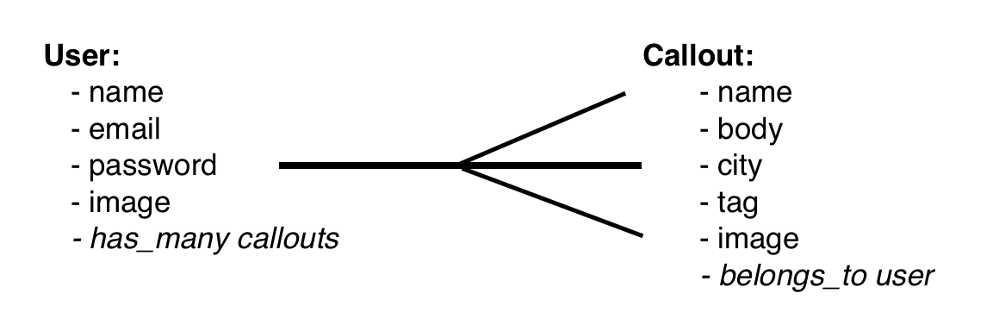
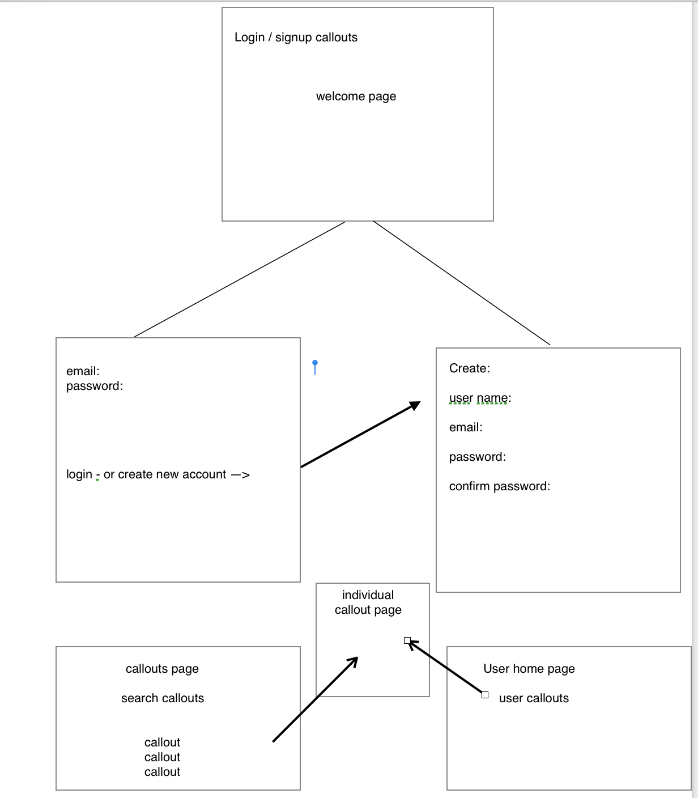

#pryx

##Correcting the world, one callout at a time.

The intention of this application is to create a simple public whistleblowing utility for the purpose of calling out human beings on poor public behavior and the recklass or insensitive treatment of others. Users can cite etiquitte violations using a method called "callouts." A callout carries a few attributes, the name of the offender, a brief explaination of the incident, the location, a subject matter tag, and an optional image. This site makes no claims of being a reliable review service, does not provide fair or unbiased information, nor does it provide any positive social media function whatsoever. Unlike most other platforms, pryx embraces its negativity in the spirit of valuing honesety over a marketing and manipulation norm that feeds existensial emptiness while providing a platform for harrassment and online bullying. Pryx is simply a place where terrible human beings can give "negative-stars" feedback to other terrible human beings for bullshit behavior. 

**Instructions -**
Create a user and post callouts. Read other peoples callouts. Be informed, stay woke. 

- Created with Ruby on Rails (5.1.4) incorporating Bootstrap, postgres, heroku, amazon web services.

Current bugs and issues:

- Delete button on callout cards not working.

Future features: 

- Menus to browse callouts by tag or location.
- Comments on callouts

Link to trello: 
https://trello.com/b/2ZMBI0H1/pryx

